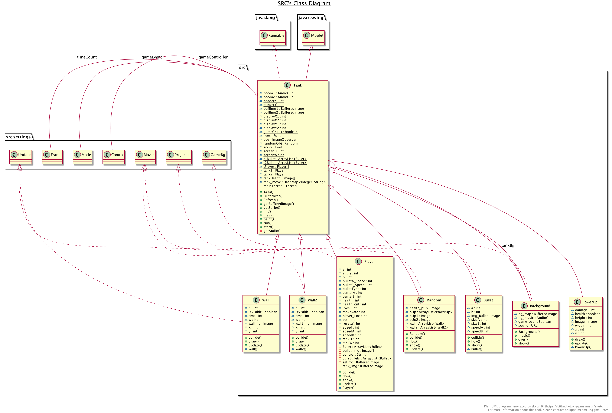
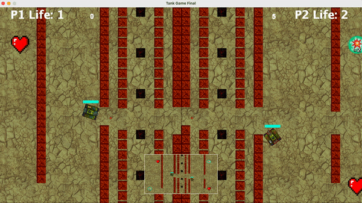
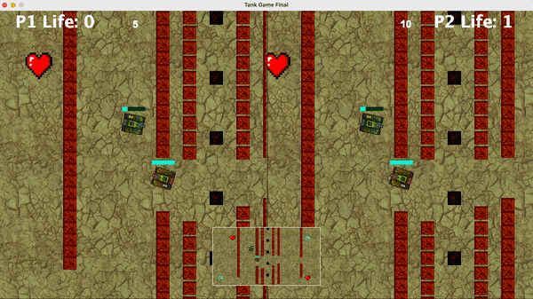

# Tank-Game

## DESCRIPTION
The objective of this game is to destroy the other player i.e., Tank.  
It consists of two tanks each with their own screen and a shared map.  
They are located on two sides of the map and the objective is to destroy the rival tank using arrow keys and WASD keys for Player 1 and 2 respectively. 
The life of each tank is displayed on the tank and there are different power-ups to give special powers to the tank if the player collects it.  
There are breakable and unbreakable walls.  
Power-ups consists of “FULL LIFE”, “2X HITS” and “SUPER (BOTH)”.  
Each player has 3 lives and the game ends if either player dies. The score and life count is displayed on the screen. 
The player with the highest points wins.

## DEVELOPMENT ENVIRONMENT
Version of JAVA Used: Java JDK 1.8.0_191  
IDE Used: IntelliJ IDEA 2020.2.3

## STEPS TO BUILD AND IMPORT
Use the root folder to import the files directly into IntelliJ. 
In IntelliJ, go to "Project Structure -> Modules", and change the following settings. 
Set the Github repo as the Content Root. 
Set the TankGame/ SuperRainbowReef folder as a Source. 
Build the Tank class and the Game class in first and second game folder respectively.  
The jar file was built by adding Artifacts in the File/Project Structure dialog and declaring the root of the jar file. 
Then the artifact is built using the Build/Build Artifacts and the jar file is created which can be run by double clicking on it.

## STEPS TO RUN THE GAME
Right click on the "Tank" class or “Game” class depending on the game and select Run.  
The game starts immediately once launched. 
The games can also be run by launching the included .jar file via the command line located in the JAR folder or running the jar file in IntelliJ.  
The Tank Game consists of two tanks each with their own screen and a shared map. 
The objective is to destroy the rival tank using ARROW keys and WASD keys to move tank Up or Down and Rotate Left or Right for Player 1 and 2 respectively. 
There are breakable and unbreakable walls. 
Power-ups consists of “FULL LIFE”, “2X HITS” and “SUPER (BOTH)”. 
Each player has 3 lives and the game ends if either player dies. 
The player with the highest points wins.

## CLASS DESCRIPTION OF TANK GAME
* Background.java : Creates and loads the background on the tank game window.
* Bullet.java : Creates a projectile and defines the direction and movement of the bullet.
* Player.java : Used to keep the track of the player’s position on the map when keys are pressed to move the tank.
* PowerUp.java : Used to load and update the powerups in the game and define them.
* Random.java : To load the power up images and to update tanks on collision and to display walls on window.
* Tank.java : This is the main class and is used to load images of tanks, walls, music, collision sound, bullet sounds and all other sprites. Also to define the area of tank movement and the mini map and 2 displays.
* Wall.java : Used to load breakable wall and define it on collision.
* Wall2.java : Used to load unbreakable wall and define it on collision.

## UML DIAGRAM

## GAMEPLAY

